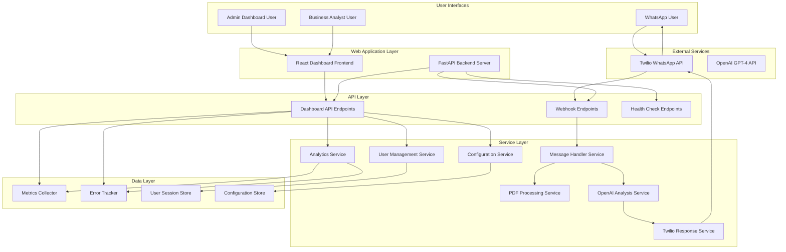

# Design Document

## Overview

The Reality Checker is a comprehensive AI-powered job advertisement scam detection platform that combines a WhatsApp bot service with a web-based management interface. The system integrates with Twilio's WhatsApp Business API to provide real-time scam analysis while offering administrators and business stakeholders powerful dashboards for monitoring, analytics, and system management.

The platform consists of two main components:

1. **WhatsApp Bot Service**: FastAPI-based microservice handling WhatsApp interactions and AI analysis
2. **Web Management Interface**: React-based dashboard providing real-time monitoring, analytics, user management, and configuration capabilities

The system follows a clean architecture pattern with clear separation of concerns between API handling, business logic, external service integrations, and user interface components.

## Architecture

### High-Level Architecture



### System Components

#### Backend Services

1. **FastAPI Application**: Main web server handling HTTP requests and serving dashboard APIs
2. **Webhook Handler**: Processes incoming Twilio webhook requests
3. **Message Processing Service**: Orchestrates the analysis workflow
4. **PDF Processing Service**: Extracts text from uploaded PDF files
5. **OpenAI Integration Service**: Handles GPT-4 API calls for scam analysis
6. **Response Service**: Formats and sends responses back via Twilio
7. **Analytics Service**: Processes and aggregates usage data for dashboards
8. **User Management Service**: Manages WhatsApp user interactions and history
9. **Configuration Service**: Manages system settings and bot configuration
10. **Authentication Service**: Handles admin dashboard login and session management

#### Frontend Components

11. **React Dashboard Application**: Main web interface for administration and monitoring
12. **Admin Dashboard**: System health monitoring and configuration management
13. **Analytics Dashboard**: Usage statistics, trends, and business intelligence
14. **Real-time Monitoring**: Live metrics and active request tracking
15. **User Management Interface**: WhatsApp user interaction history and management
16. **Reporting Module**: Generate and export comprehensive reports

#### Data Storage

17. **Metrics Collector**: Time-series data for performance monitoring
18. **Error Tracker**: Error logging and alerting system
19. **User Session Store**: WhatsApp user interaction history
20. **Configuration Store**: System settings and bot configuration
21. **Analytics Database**: Aggregated data for reporting and insights

## Components and Interfaces

### API Endpoints

#### WhatsApp Bot Endpoints

##### POST /webhook/whatsapp

- **Purpose**: Receive incoming WhatsApp messages from Twilio
- **Input**: Twilio webhook payload (form-encoded)
- **Output**: TwiML response or HTTP 200
- **Authentication**: Twilio signature validation (optional but recommended)

##### GET /health

- **Purpose**: Health check endpoint for monitoring
- **Input**: None
- **Output**: JSON with system status and timestamp

#### Dashboard API Endpoints

##### GET /api/dashboard/overview

- **Purpose**: Get dashboard overview data
- **Authentication**: Required (JWT token)
- **Response Format**:

```json
{
  "total_requests": 1250,
  "requests_today": 45,
  "error_rate": 2.3,
  "avg_response_time": 1.2,
  "active_users": 23,
  "system_health": "healthy"
}
```

##### GET /api/analytics/trends

- **Purpose**: Get analysis trends and statistics
- **Authentication**: Required (JWT token)
- **Query Parameters**: `period` (day/week/month), `start_date`, `end_date`
- **Response Format**:

```json
{
  "period": "week",
  "classifications": {
    "legit": 65,
    "suspicious": 25,
    "scam": 10
  },
  "daily_counts": [
    { "date": "2025-01-15", "count": 45 },
    { "date": "2025-01-16", "count": 52 }
  ]
}
```

##### GET /api/users

- **Purpose**: Get WhatsApp user list and interaction history
- **Authentication**: Required (JWT token)
- **Query Parameters**: `page`, `limit`, `search`
- **Response Format**:

```json
{
  "users": [
    {
      "phone_number": "+1234567890",
      "first_interaction": "2025-01-15T10:30:00Z",
      "last_interaction": "2025-01-16T14:20:00Z",
      "total_requests": 5,
      "blocked": false
    }
  ],
  "total": 150,
  "page": 1,
  "pages": 15
}
```

##### GET /api/metrics/realtime

- **Purpose**: Get real-time system metrics
- **Authentication**: Required (JWT token)
- **Response Format**:

```json
{
  "timestamp": "2025-01-16T15:30:00Z",
  "active_requests": 3,
  "requests_per_minute": 12,
  "error_rate": 1.5,
  "response_times": {
    "p50": 0.8,
    "p95": 2.1,
    "p99": 3.5
  },
  "service_status": {
    "openai": "healthy",
    "twilio": "healthy"
  }
}
```

##### POST /api/config

- **Purpose**: Update system configuration
- **Authentication**: Required (Admin role)
- **Input**: Configuration updates
- **Response**: Updated configuration

##### POST /api/reports/generate

- **Purpose**: Generate custom reports
- **Authentication**: Required (JWT token)
- **Input**: Report parameters (type, date range, format)
- **Response**: Report data or download link

### Core Services

#### MessageHandlerService

```python
class MessageHandlerService:
    async def process_message(self, twilio_request: TwilioWebhookRequest) -> str
    async def handle_text_message(self, text: str, from_number: str) -> str
    async def handle_media_message(self, media_url: str, from_number: str) -> str
```

#### PDFProcessingService

```python
class PDFProcessingService:
    async def download_pdf(self, media_url: str) -> bytes
    async def extract_text(self, pdf_content: bytes) -> str
    def validate_pdf_content(self, text: str) -> bool
```

#### OpenAIAnalysisService

```python
class OpenAIAnalysisService:
    async def analyze_job_ad(self, job_text: str) -> JobAnalysisResult
    def build_analysis_prompt(self, job_text: str) -> str
    def parse_analysis_response(self, response: str) -> JobAnalysisResult
```

#### TwilioResponseService

```python
class TwilioResponseService:
    async def send_whatsapp_message(self, to_number: str, message: str) -> bool
    def format_analysis_response(self, analysis: JobAnalysisResult) -> str
    def create_error_response(self, error_type: str) -> str
```

#### AnalyticsService

```python
class AnalyticsService:
    async def get_dashboard_overview(self) -> DashboardOverview
    async def get_analysis_trends(self, period: str, start_date: str, end_date: str) -> AnalyticsTrends
    async def get_classification_breakdown(self, period: str) -> Dict[str, int]
    async def get_usage_statistics(self) -> UsageStatistics
    async def generate_report(self, report_type: str, parameters: Dict) -> ReportData
```

#### UserManagementService

```python
class UserManagementService:
    async def get_users(self, page: int, limit: int, search: str) -> UserList
    async def get_user_details(self, phone_number: str) -> UserDetails
    async def get_user_interactions(self, phone_number: str) -> List[UserInteraction]
    async def block_user(self, phone_number: str) -> bool
    async def unblock_user(self, phone_number: str) -> bool
    async def record_interaction(self, interaction: UserInteraction) -> None
```

#### ConfigurationService

```python
class ConfigurationService:
    async def get_configuration(self) -> SystemConfiguration
    async def update_configuration(self, config: SystemConfiguration) -> bool
    async def validate_configuration(self, config: SystemConfiguration) -> ValidationResult
    async def reload_configuration(self) -> bool
```

#### AuthenticationService

```python
class AuthenticationService:
    async def authenticate_user(self, username: str, password: str) -> AuthResult
    async def generate_jwt_token(self, user: User) -> str
    async def validate_jwt_token(self, token: str) -> TokenValidation
    async def refresh_token(self, refresh_token: str) -> str
    async def logout_user(self, token: str) -> bool
```

## Data Models

### TwilioWebhookRequest

```python
@dataclass
class TwilioWebhookRequest:
    MessageSid: str
    From: str
    To: str
    Body: str
    NumMedia: int
    MediaUrl0: Optional[str] = None
    MediaContentType0: Optional[str] = None
```

### JobAnalysisResult

```python
@dataclass
class JobAnalysisResult:
    trust_score: int  # 0-100
    classification: str  # "Legit", "Suspicious", "Likely Scam"
    reasons: List[str]  # Exactly 3 reasons
    confidence: float  # Internal confidence metric
```

### Configuration

```python
@dataclass
class AppConfig:
    openai_api_key: str
    twilio_account_sid: str
    twilio_auth_token: str
    twilio_phone_number: str
    max_pdf_size_mb: int = 10
    openai_model: str = "gpt-4"
    log_level: str = "INFO"
    jwt_secret_key: str = ""
    admin_username: str = "admin"
    admin_password: str = ""
```

### Dashboard Data Models

```python
@dataclass
class DashboardOverview:
    total_requests: int
    requests_today: int
    error_rate: float
    avg_response_time: float
    active_users: int
    system_health: str
    timestamp: datetime

@dataclass
class AnalyticsTrends:
    period: str
    classifications: Dict[str, int]
    daily_counts: List[Dict[str, Any]]
    peak_hours: List[int]
    user_engagement: Dict[str, float]

@dataclass
class UserDetails:
    phone_number: str
    first_interaction: datetime
    last_interaction: datetime
    total_requests: int
    blocked: bool
    interaction_history: List['UserInteraction']

@dataclass
class UserInteraction:
    timestamp: datetime
    message_type: str  # "text" or "pdf"
    analysis_result: Optional[JobAnalysisResult]
    response_time: float
    error: Optional[str]

@dataclass
class SystemConfiguration:
    openai_model: str
    max_pdf_size_mb: int
    rate_limit_per_minute: int
    webhook_validation: bool
    log_level: str
    alert_thresholds: Dict[str, float]

@dataclass
class ReportData:
    report_type: str
    generated_at: datetime
    period: str
    data: Dict[str, Any]
    export_format: str
    download_url: Optional[str]

@dataclass
class User:
    username: str
    role: str  # "admin" or "analyst"
    created_at: datetime
    last_login: Optional[datetime]

@dataclass
class AuthResult:
    success: bool
    user: Optional[User]
    token: Optional[str]
    refresh_token: Optional[str]
    error_message: Optional[str]
```

## Error Handling

### Error Categories

1. **Input Validation Errors**

   - Invalid Twilio webhook format
   - Missing required fields
   - Unsupported media types

2. **Processing Errors**

   - PDF download failures
   - PDF text extraction failures
   - Empty or invalid content

3. **External Service Errors**

   - OpenAI API failures
   - Twilio API failures
   - Network timeouts

4. **System Errors**
   - Configuration errors
   - Resource exhaustion
   - Unexpected exceptions

### Error Response Strategy

```python
class ErrorHandler:
    def handle_pdf_error(self) -> str:
        return "Sorry, I couldn't process that PDF. Please try sending the job ad as text instead."

    def handle_openai_error(self) -> str:
        return "I'm having trouble analyzing that right now. Please try again in a few minutes."

    def handle_generic_error(self) -> str:
        return "Something went wrong. Please try sending your job ad again."
```

### Logging Strategy

- Use structured logging with JSON format
- Log levels: DEBUG, INFO, WARNING, ERROR, CRITICAL
- Include correlation IDs for request tracking
- Sanitize sensitive data (phone numbers, API keys)

## Frontend Architecture

### React Dashboard Application

The web-based management interface is built using React with TypeScript, providing a modern, responsive dashboard for system administration and analytics.

#### Technology Stack

- **React 18**: Main frontend framework with hooks and functional components
- **TypeScript**: Type safety and better development experience
- **Material-UI (MUI)**: Component library for consistent design
- **React Router**: Client-side routing for single-page application
- **React Query**: Data fetching, caching, and synchronization
- **Chart.js/Recharts**: Data visualization for analytics dashboards
- **Socket.io Client**: Real-time updates for live monitoring
- **Axios**: HTTP client for API communication

#### Dashboard Components

##### 1. Admin Dashboard (`/admin`)

```typescript
interface AdminDashboardProps {
  systemHealth: SystemHealth;
  metrics: SystemMetrics;
  alerts: Alert[];
}

const AdminDashboard: React.FC<AdminDashboardProps> = ({
  systemHealth,
  metrics,
  alerts,
}) => {
  return (
    <Grid container spacing={3}>
      <SystemHealthCard health={systemHealth} />
      <MetricsOverviewCard metrics={metrics} />
      <ActiveAlertsCard alerts={alerts} />
      <ServiceStatusGrid services={systemHealth.services} />
    </Grid>
  );
};
```

##### 2. Analytics Dashboard (`/analytics`)

```typescript
interface AnalyticsDashboardProps {
  trends: AnalyticsTrends;
  period: string;
  onPeriodChange: (period: string) => void;
}

const AnalyticsDashboard: React.FC<AnalyticsDashboardProps> = ({
  trends,
  period,
  onPeriodChange,
}) => {
  return (
    <Box>
      <PeriodSelector value={period} onChange={onPeriodChange} />
      <Grid container spacing={3}>
        <ClassificationChart data={trends.classifications} />
        <UsageTrendsChart data={trends.daily_counts} />
        <PeakHoursChart data={trends.peak_hours} />
        <UserEngagementMetrics data={trends.user_engagement} />
      </Grid>
    </Box>
  );
};
```

##### 3. Real-time Monitoring (`/monitoring`)

```typescript
const RealTimeMonitoring: React.FC = () => {
  const { data: metrics } = useRealTimeMetrics(); // WebSocket connection

  return (
    <Grid container spacing={2}>
      <LiveMetricsCard metrics={metrics} />
      <ActiveRequestsTable requests={metrics?.active_requests} />
      <ErrorRateChart data={metrics?.error_history} />
      <ResponseTimeChart data={metrics?.response_times} />
    </Grid>
  );
};
```

##### 4. User Management (`/users`)

```typescript
interface UserManagementProps {
  users: UserDetails[];
  onBlockUser: (phoneNumber: string) => void;
  onUnblockUser: (phoneNumber: string) => void;
}

const UserManagement: React.FC<UserManagementProps> = ({
  users,
  onBlockUser,
  onUnblockUser,
}) => {
  return (
    <Box>
      <UserSearchBar onSearch={handleSearch} />
      <UserTable
        users={users}
        onBlock={onBlockUser}
        onUnblock={onUnblockUser}
      />
      <UserInteractionModal />
    </Box>
  );
};
```

##### 5. Configuration Management (`/config`)

```typescript
interface ConfigurationProps {
  config: SystemConfiguration;
  onSave: (config: SystemConfiguration) => void;
}

const ConfigurationManagement: React.FC<ConfigurationProps> = ({
  config,
  onSave,
}) => {
  return (
    <Form onSubmit={handleSubmit}>
      <ConfigSection title="OpenAI Settings">
        <ModelSelector value={config.openai_model} />
        <RateLimitInput value={config.rate_limit_per_minute} />
      </ConfigSection>
      <ConfigSection title="System Settings">
        <PDFSizeInput value={config.max_pdf_size_mb} />
        <LogLevelSelector value={config.log_level} />
      </ConfigSection>
      <AlertThresholdSettings thresholds={config.alert_thresholds} />
    </Form>
  );
};
```

#### State Management

```typescript
// Global state using React Context
interface AppState {
  user: User | null;
  systemHealth: SystemHealth;
  notifications: Notification[];
  theme: "light" | "dark";
}

const AppContext = createContext<{
  state: AppState;
  dispatch: React.Dispatch<AppAction>;
}>();

// Custom hooks for data fetching
const useSystemHealth = () => {
  return useQuery("systemHealth", fetchSystemHealth, {
    refetchInterval: 30000, // Refresh every 30 seconds
  });
};

const useAnalytics = (period: string) => {
  return useQuery(["analytics", period], () => fetchAnalytics(period));
};
```

#### Real-time Updates

```typescript
// WebSocket connection for real-time updates
const useWebSocket = () => {
  const [socket, setSocket] = useState<Socket | null>(null);

  useEffect(() => {
    const newSocket = io("/ws", {
      auth: { token: getAuthToken() },
    });

    newSocket.on("metrics_update", (data) => {
      // Update real-time metrics
    });

    newSocket.on("alert", (alert) => {
      // Show new alert notification
    });

    setSocket(newSocket);

    return () => newSocket.close();
  }, []);

  return socket;
};
```

### UI/UX Design Principles

#### Responsive Design

- Mobile-first approach with breakpoints for tablet and desktop
- Flexible grid system using Material-UI Grid
- Adaptive navigation for different screen sizes

#### Accessibility

- WCAG 2.1 AA compliance
- Keyboard navigation support
- Screen reader compatibility
- High contrast mode support

#### Performance

- Code splitting for route-based lazy loading
- Memoization of expensive components
- Virtual scrolling for large data tables
- Image optimization and lazy loading

## Testing Strategy

### Unit Tests

- **Service Layer Tests**: Mock external dependencies
- **Data Model Tests**: Validate serialization/deserialization
- **Utility Function Tests**: PDF processing, text formatting
- **Configuration Tests**: Environment variable handling

### Integration Tests

- **Webhook Endpoint Tests**: Full request/response cycle
- **OpenAI Integration Tests**: Real API calls with test data
- **Twilio Integration Tests**: Mock Twilio responses
- **PDF Processing Tests**: Sample PDF files

### End-to-End Tests

- **WhatsApp Flow Simulation**: Mock complete user interactions
- **Error Scenario Tests**: Network failures, invalid inputs
- **Performance Tests**: Concurrent request handling

### Test Data

```python
# Sample test cases
TEST_JOB_ADS = {
    "legitimate": "Software Engineer position at Google...",
    "suspicious": "Make $5000/week working from home...",
    "scam": "Send $500 for job training materials..."
}

TEST_PDF_SAMPLES = [
    "legitimate_job_posting.pdf",
    "suspicious_job_ad.pdf",
    "corrupted_file.pdf"
]
```

## Security Considerations

### API Security

- Validate Twilio webhook signatures
- Rate limiting on webhook endpoint
- Input sanitization for all user content
- HTTPS enforcement

### Data Protection

- No persistent storage of user messages
- Temporary file cleanup for PDF processing
- API key rotation capabilities
- Audit logging for sensitive operations

### OpenAI Integration Security

- Content filtering for inappropriate inputs
- Token usage monitoring
- Response validation and sanitization
- Fallback responses for API failures

## Performance Considerations

### Scalability

- Async/await pattern for I/O operations
- Connection pooling for HTTP clients
- Configurable timeouts for external services
- Memory-efficient PDF processing

### Optimization

- Response caching for similar job ads (optional)
- Batch processing for multiple media files
- Streaming responses for large content
- Resource monitoring and alerting

## Deployment Architecture

### Local Development

- Uvicorn ASGI server
- Environment-based configuration
- Hot reload for development
- Local testing with ngrok for webhooks

### Production Deployment

- Containerized deployment (Docker)
- Load balancer for high availability
- Health check integration
- Monitoring and logging infrastructure
- Environment-specific configurations

### Environment Variables

```bash
# Required
OPENAI_API_KEY=sk-...
TWILIO_ACCOUNT_SID=AC...
TWILIO_AUTH_TOKEN=...
TWILIO_PHONE_NUMBER=+1...

# Optional
MAX_PDF_SIZE_MB=10
OPENAI_MODEL=gpt-4
LOG_LEVEL=INFO
WEBHOOK_VALIDATION=true
```
