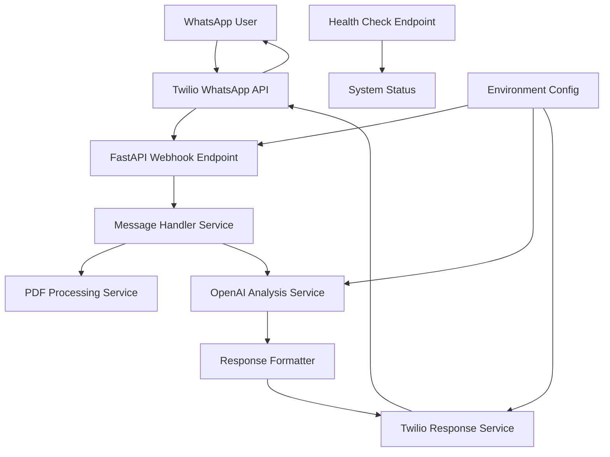

# Design Document

## Overview

The Reality Checker WhatsApp bot is a FastAPI-based microservice that integrates with Twilio's WhatsApp Business API to provide AI-powered job advertisement scam detection. The application receives WhatsApp messages via webhooks, processes text or PDF content, analyzes it using OpenAI GPT-4, and returns structured feedback about the legitimacy of job postings.

The system follows a clean architecture pattern with clear separation of concerns between API handling, business logic, and external service integrations.

## Architecture

### High-Level Architecture



### System Components

1. **FastAPI Application**: Main web server handling HTTP requests
2. **Webhook Handler**: Processes incoming Twilio webhook requests
3. **Message Processing Service**: Orchestrates the analysis workflow
4. **PDF Processing Service**: Extracts text from uploaded PDF files
5. **OpenAI Integration Service**: Handles GPT-4 API calls for scam analysis
6. **Response Service**: Formats and sends responses back via Twilio
7. **Configuration Manager**: Manages environment variables and secrets

## Components and Interfaces

### API Endpoints

#### POST /webhook/whatsapp
- **Purpose**: Receive incoming WhatsApp messages from Twilio
- **Input**: Twilio webhook payload (form-encoded)
- **Output**: TwiML response or HTTP 200
- **Authentication**: Twilio signature validation (optional but recommended)

#### GET /health
- **Purpose**: Health check endpoint for monitoring
- **Input**: None
- **Output**: JSON with system status and timestamp
- **Response Format**:
```json
{
  "status": "healthy",
  "timestamp": "2025-01-15T10:30:00Z",
  "services": {
    "openai": "connected",
    "twilio": "connected"
  }
}
```

### Core Services

#### MessageHandlerService
```python
class MessageHandlerService:
    async def process_message(self, twilio_request: TwilioWebhookRequest) -> str
    async def handle_text_message(self, text: str, from_number: str) -> str
    async def handle_media_message(self, media_url: str, from_number: str) -> str
```

#### PDFProcessingService
```python
class PDFProcessingService:
    async def download_pdf(self, media_url: str) -> bytes
    async def extract_text(self, pdf_content: bytes) -> str
    def validate_pdf_content(self, text: str) -> bool
```

#### OpenAIAnalysisService
```python
class OpenAIAnalysisService:
    async def analyze_job_ad(self, job_text: str) -> JobAnalysisResult
    def build_analysis_prompt(self, job_text: str) -> str
    def parse_analysis_response(self, response: str) -> JobAnalysisResult
```

#### TwilioResponseService
```python
class TwilioResponseService:
    async def send_whatsapp_message(self, to_number: str, message: str) -> bool
    def format_analysis_response(self, analysis: JobAnalysisResult) -> str
    def create_error_response(self, error_type: str) -> str
```

## Data Models

### TwilioWebhookRequest
```python
@dataclass
class TwilioWebhookRequest:
    MessageSid: str
    From: str
    To: str
    Body: str
    NumMedia: int
    MediaUrl0: Optional[str] = None
    MediaContentType0: Optional[str] = None
```

### JobAnalysisResult
```python
@dataclass
class JobAnalysisResult:
    trust_score: int  # 0-100
    classification: str  # "Legit", "Suspicious", "Likely Scam"
    reasons: List[str]  # Exactly 3 reasons
    confidence: float  # Internal confidence metric
```

### Configuration
```python
@dataclass
class AppConfig:
    openai_api_key: str
    twilio_account_sid: str
    twilio_auth_token: str
    twilio_phone_number: str
    max_pdf_size_mb: int = 10
    openai_model: str = "gpt-4"
    log_level: str = "INFO"
```

## Error Handling

### Error Categories

1. **Input Validation Errors**
   - Invalid Twilio webhook format
   - Missing required fields
   - Unsupported media types

2. **Processing Errors**
   - PDF download failures
   - PDF text extraction failures
   - Empty or invalid content

3. **External Service Errors**
   - OpenAI API failures
   - Twilio API failures
   - Network timeouts

4. **System Errors**
   - Configuration errors
   - Resource exhaustion
   - Unexpected exceptions

### Error Response Strategy

```python
class ErrorHandler:
    def handle_pdf_error(self) -> str:
        return "Sorry, I couldn't process that PDF. Please try sending the job ad as text instead."
    
    def handle_openai_error(self) -> str:
        return "I'm having trouble analyzing that right now. Please try again in a few minutes."
    
    def handle_generic_error(self) -> str:
        return "Something went wrong. Please try sending your job ad again."
```

### Logging Strategy
- Use structured logging with JSON format
- Log levels: DEBUG, INFO, WARNING, ERROR, CRITICAL
- Include correlation IDs for request tracking
- Sanitize sensitive data (phone numbers, API keys)

## Testing Strategy

### Unit Tests
- **Service Layer Tests**: Mock external dependencies
- **Data Model Tests**: Validate serialization/deserialization
- **Utility Function Tests**: PDF processing, text formatting
- **Configuration Tests**: Environment variable handling

### Integration Tests
- **Webhook Endpoint Tests**: Full request/response cycle
- **OpenAI Integration Tests**: Real API calls with test data
- **Twilio Integration Tests**: Mock Twilio responses
- **PDF Processing Tests**: Sample PDF files

### End-to-End Tests
- **WhatsApp Flow Simulation**: Mock complete user interactions
- **Error Scenario Tests**: Network failures, invalid inputs
- **Performance Tests**: Concurrent request handling

### Test Data
```python
# Sample test cases
TEST_JOB_ADS = {
    "legitimate": "Software Engineer position at Google...",
    "suspicious": "Make $5000/week working from home...",
    "scam": "Send $500 for job training materials..."
}

TEST_PDF_SAMPLES = [
    "legitimate_job_posting.pdf",
    "suspicious_job_ad.pdf",
    "corrupted_file.pdf"
]
```

## Security Considerations

### API Security
- Validate Twilio webhook signatures
- Rate limiting on webhook endpoint
- Input sanitization for all user content
- HTTPS enforcement

### Data Protection
- No persistent storage of user messages
- Temporary file cleanup for PDF processing
- API key rotation capabilities
- Audit logging for sensitive operations

### OpenAI Integration Security
- Content filtering for inappropriate inputs
- Token usage monitoring
- Response validation and sanitization
- Fallback responses for API failures

## Performance Considerations

### Scalability
- Async/await pattern for I/O operations
- Connection pooling for HTTP clients
- Configurable timeouts for external services
- Memory-efficient PDF processing

### Optimization
- Response caching for similar job ads (optional)
- Batch processing for multiple media files
- Streaming responses for large content
- Resource monitoring and alerting

## Deployment Architecture

### Local Development
- Uvicorn ASGI server
- Environment-based configuration
- Hot reload for development
- Local testing with ngrok for webhooks

### Production Deployment
- Containerized deployment (Docker)
- Load balancer for high availability
- Health check integration
- Monitoring and logging infrastructure
- Environment-specific configurations

### Environment Variables
```bash
# Required
OPENAI_API_KEY=sk-...
TWILIO_ACCOUNT_SID=AC...
TWILIO_AUTH_TOKEN=...
TWILIO_PHONE_NUMBER=+1...

# Optional
MAX_PDF_SIZE_MB=10
OPENAI_MODEL=gpt-4
LOG_LEVEL=INFO
WEBHOOK_VALIDATION=true
```