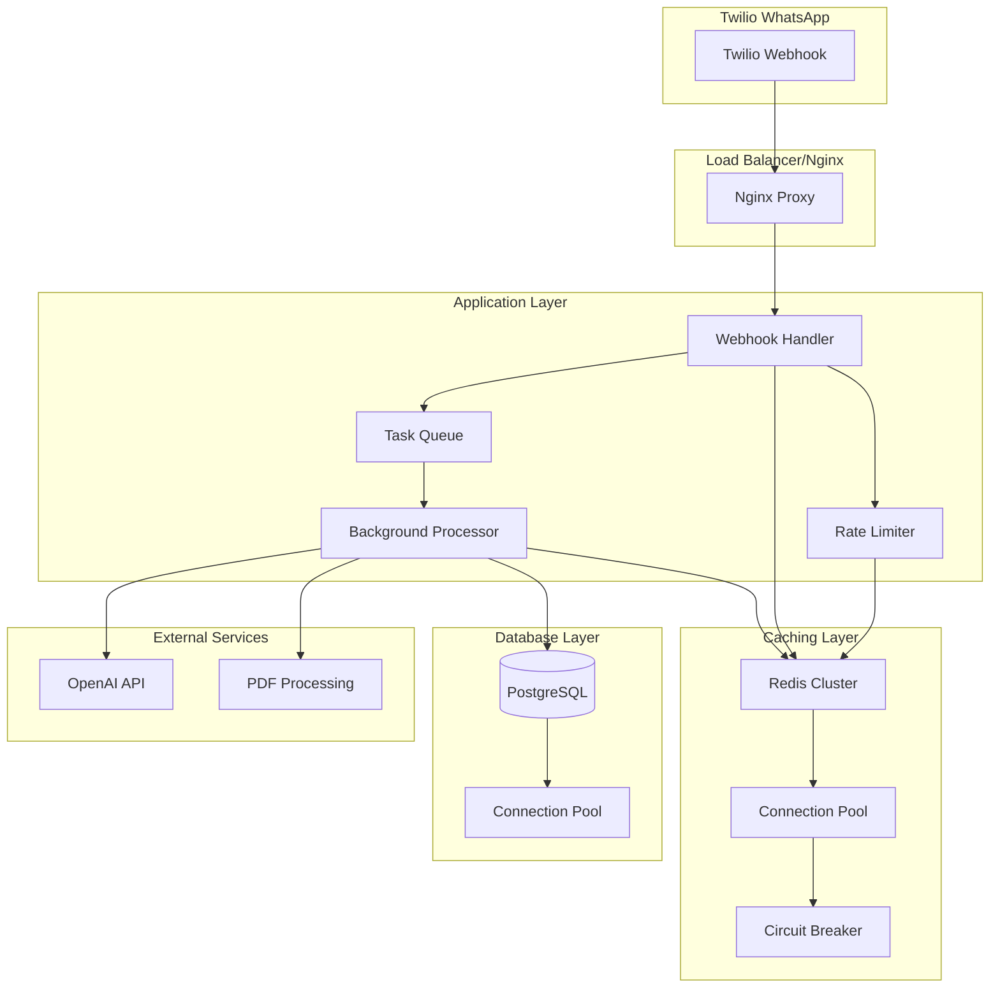
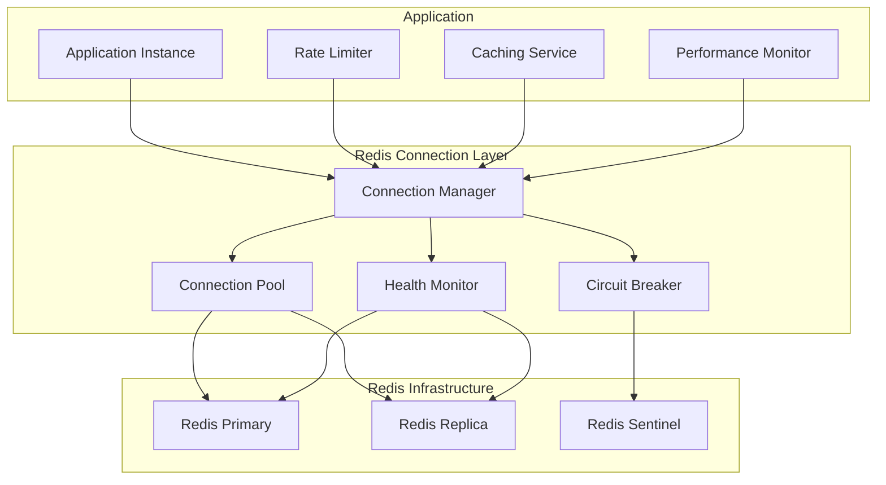

# Design Document

## Overview

This design addresses critical performance and reliability issues in the Reality Checker WhatsApp bot by implementing a comprehensive Redis connectivity and webhook performance optimization solution. The system currently experiences Redis connection failures and webhook response times exceeding 14 seconds, which causes Twilio timeouts and poor user experience.

The solution focuses on three key areas:
1. **Resilient Redis Connectivity** - Implementing robust connection management with automatic failover
2. **Webhook Performance Optimization** - Reducing response times through asynchronous processing and caching
3. **Background Task Processing** - Decoupling message processing from webhook acknowledgment

## Architecture

### High-Level Architecture



### Redis Connection Architecture



## Components and Interfaces

### 1. Redis Connection Manager

**Purpose**: Manage Redis connections with automatic failover and health monitoring

**Key Features**:
- Connection pooling with configurable pool sizes
- Automatic reconnection with exponential backoff
- Circuit breaker pattern for fault tolerance
- Health monitoring and metrics collection
- Graceful degradation when Redis is unavailable

**Interface**:
```python
class RedisConnectionManager:
    async def initialize() -> bool
    async def get_connection() -> Redis
    async def execute_command(command: str, *args) -> Any
    async def health_check() -> HealthStatus
    async def get_metrics() -> ConnectionMetrics
    def is_available() -> bool
```

### 2. Enhanced Webhook Handler

**Purpose**: Process webhook requests with optimized performance and reliability

**Key Features**:
- Sub-500ms response time for acknowledgment
- Asynchronous message processing
- Request validation and sanitization
- Error handling with fallback responses
- Performance monitoring and alerting

**Interface**:
```python
class OptimizedWebhookHandler:
    async def handle_webhook(request: Request) -> Response
    async def validate_request(request: Request) -> ValidationResult
    async def queue_message(message: TwilioWebhookRequest) -> bool
    async def send_acknowledgment() -> Response
```

### 3. Background Task Processor

**Purpose**: Process messages asynchronously without blocking webhook responses

**Key Features**:
- Task queuing with priority levels
- Retry logic with exponential backoff
- Dead letter queue for failed tasks
- Resource-aware processing
- Progress tracking and monitoring

**Interface**:
```python
class BackgroundTaskProcessor:
    async def queue_task(task: ProcessingTask) -> TaskId
    async def process_task(task: ProcessingTask) -> TaskResult
    async def retry_failed_task(task_id: TaskId) -> bool
    async def get_queue_status() -> QueueStatus
```

### 4. Performance Monitor

**Purpose**: Monitor system performance and trigger alerts

**Key Features**:
- Real-time performance metrics
- Threshold-based alerting
- Resource utilization tracking
- Performance trend analysis
- Automated scaling recommendations

**Interface**:
```python
class PerformanceMonitor:
    async def record_webhook_timing(duration: float) -> None
    async def record_redis_operation(operation: str, duration: float) -> None
    async def check_thresholds() -> List[Alert]
    async def get_performance_summary() -> PerformanceReport
```

## Data Models

### Redis Connection Configuration
```python
@dataclass
class RedisConfig:
    primary_url: str
    replica_urls: List[str]
    sentinel_urls: List[str]
    pool_size: int = 20
    max_connections: int = 50
    connection_timeout: float = 5.0
    socket_timeout: float = 5.0
    retry_attempts: int = 3
    retry_backoff: float = 1.0
    health_check_interval: int = 30
    circuit_breaker_threshold: int = 5
    circuit_breaker_timeout: int = 60
```

### Task Queue Configuration
```python
@dataclass
class TaskQueueConfig:
    max_queue_size: int = 1000
    worker_count: int = 5
    batch_size: int = 10
    processing_timeout: int = 30
    retry_attempts: int = 3
    retry_backoff: float = 2.0
    dead_letter_threshold: int = 5
    priority_levels: int = 3
```

### Performance Metrics
```python
@dataclass
class PerformanceMetrics:
    webhook_response_time: float
    redis_operation_time: float
    task_queue_depth: int
    active_connections: int
    error_rate: float
    throughput: float
    cpu_usage: float
    memory_usage: float
    timestamp: datetime
```

## Error Handling

### Redis Connection Errors

**Connection Failure Handling**:
1. Detect connection failure through health checks
2. Activate circuit breaker to prevent cascading failures
3. Switch to fallback mode (in-memory caching for rate limiting)
4. Attempt reconnection with exponential backoff
5. Resume normal operations when connection is restored

**Timeout Handling**:
1. Set aggressive timeouts (2-5 seconds) for Redis operations
2. Cancel operations that exceed timeout
3. Log timeout events for monitoring
4. Fallback to default behavior without Redis

**Data Consistency**:
1. Use Redis transactions for atomic operations
2. Implement optimistic locking for concurrent updates
3. Handle partial failures gracefully
4. Maintain eventual consistency during Redis outages

### Webhook Processing Errors

**Validation Errors**:
1. Return HTTP 400 with specific error message
2. Log validation failure details
3. Track validation error rates
4. Implement rate limiting for invalid requests

**Processing Errors**:
1. Acknowledge webhook receipt immediately
2. Queue error handling as background task
3. Send user-friendly error messages
4. Implement retry logic for transient failures

**Timeout Prevention**:
1. Set maximum webhook processing time to 2 seconds
2. Queue long-running tasks for background processing
3. Return acknowledgment before starting heavy operations
4. Monitor and alert on processing time violations

## Testing Strategy

### Unit Tests

**Redis Connection Manager**:
- Connection establishment and failure scenarios
- Circuit breaker activation and recovery
- Health check accuracy
- Metrics collection correctness

**Webhook Handler**:
- Request validation logic
- Response time requirements
- Error handling paths
- Asynchronous processing

**Background Task Processor**:
- Task queuing and processing
- Retry logic and backoff
- Dead letter queue handling
- Resource management

### Integration Tests

**Redis Integration**:
- Connection pooling under load
- Failover scenarios
- Data consistency during outages
- Performance under stress

**Webhook Integration**:
- End-to-end message processing
- Twilio webhook simulation
- Error scenario handling
- Performance benchmarking

**System Integration**:
- Full system load testing
- Failure injection testing
- Recovery time measurement
- Monitoring and alerting validation

### Performance Tests

**Load Testing**:
- Concurrent webhook processing
- Redis operation throughput
- Memory usage under load
- Connection pool exhaustion

**Stress Testing**:
- System behavior at capacity limits
- Graceful degradation testing
- Recovery after overload
- Resource leak detection

**Benchmark Testing**:
- Webhook response time measurement
- Redis operation latency
- Task processing throughput
- System resource utilization

### Monitoring and Observability

**Metrics Collection**:
- Webhook response times (p50, p95, p99)
- Redis operation latencies
- Task queue depths and processing times
- Error rates and types
- System resource utilization

**Alerting Rules**:
- Webhook response time > 1 second (warning)
- Webhook response time > 3 seconds (critical)
- Redis connection failures > 5% (warning)
- Task queue depth > 500 (warning)
- Error rate > 5% (critical)

**Dashboards**:
- Real-time performance metrics
- Redis connection health
- Task processing status
- Error rate trends
- Resource utilization graphs

**Logging Strategy**:
- Structured logging with correlation IDs
- Performance timing logs
- Error context and stack traces
- Redis operation logs
- Task processing lifecycle logs