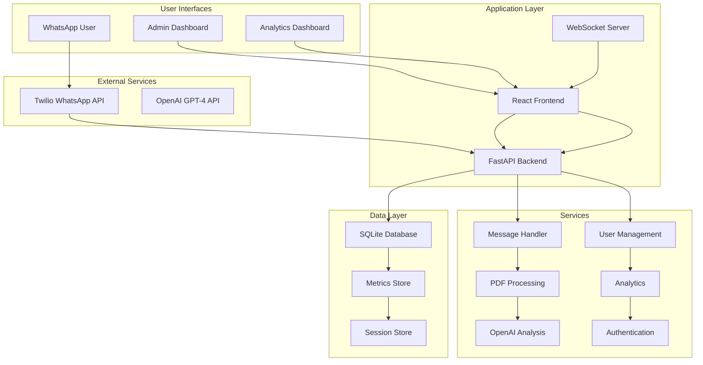

# Reality Checker WhatsApp Bot

[](https://www.python.org/downloads/)
[](https://fastapi.tiangolo.com/)
[](https://reactjs.org/)
[](https://www.typescriptlang.org/)
[](LICENSE)

> AI-powered job advertisement scam detection platform with WhatsApp integration and comprehensive web-based management dashboard.

## 🎯 Overview

Reality Checker is a comprehensive platform that combines an intelligent WhatsApp bot with a powerful web-based management interface to help users identify potential job advertisement scams. The system uses OpenAI GPT-4 for advanced scam detection and provides administrators with real-time monitoring, analytics, and user management capabilities.

### Key Features

- **🤖 WhatsApp Bot**: AI-powered scam detection via WhatsApp messages
- **📊 Web Dashboard**: Comprehensive admin and analytics interface
- **📈 Real-time Monitoring**: Live system metrics and performance tracking
- **👥 User Management**: WhatsApp user interaction history and management
- **📋 Reporting**: Custom reports with CSV/PDF export capabilities
- **🔒 Security**: JWT authentication, rate limiting, and input sanitization
- **⚡ Performance**: Async processing, caching, and real-time updates

## 🏗️ Architecture



## 🚀 Quick Start

### Prerequisites

- Python 3.11+
- Node.js 18+
- OpenAI API Key
- Twilio Account (WhatsApp Business API)

### 1. Clone the Repository

```bash
git clone https://github.com/yourusername/reality-checker-whatsapp-bot.git
cd reality-checker-whatsapp-bot
```

### 2. Backend Setup

```bash
# Create virtual environment
python -m venv venv
source venv/bin/activate  # On Windows: venv\Scripts\activate

# Install dependencies
pip install -r requirements.txt

# Copy environment template
cp .env.example .env
```

### 3. Configure Environment Variables

Edit `.env` file with your credentials:

```bash
# Required - OpenAI Configuration
OPENAI_API_KEY=sk-your-openai-api-key-here
OPENAI_MODEL=gpt-4

# Required - Twilio Configuration
TWILIO_ACCOUNT_SID=ACxxxxxxxxxxxxxxxxxxxxxxxxxxxxx
TWILIO_AUTH_TOKEN=your-twilio-auth-token
TWILIO_PHONE_NUMBER=+1234567890

# Optional - Application Settings
MAX_PDF_SIZE_MB=10
LOG_LEVEL=INFO
WEBHOOK_VALIDATION=true

# Dashboard Authentication
JWT_SECRET_KEY=your-super-secret-jwt-key
ADMIN_USERNAME=admin
ADMIN_PASSWORD=your-secure-password
```

### 4. Frontend Setup (Optional - for Dashboard)

```bash
# Navigate to frontend directory
cd frontend

# Install dependencies
npm install

# Copy environment template
cp .env.example .env.local
```

Edit `frontend/.env.local`:

```bash
REACT_APP_API_URL=http://localhost:8000
REACT_APP_WS_URL=ws://localhost:8000
```

### 5. Run the Application

#### Backend Only (API + WhatsApp Bot)

```bash
# From project root
uvicorn app.main:app --host 0.0.0.0 --port 8000 --reload
```

#### Full Stack (Backend + Frontend Dashboard)

```bash
# Terminal 1: Start backend
uvicorn app.main:app --host 0.0.0.0 --port 8000 --reload

# Terminal 2: Start frontend
cd frontend
npm start
```

### 6. Access the Application

- **API Documentation**: http://localhost:8000/docs
- **Health Check**: http://localhost:8000/health
- **Web Dashboard**: http://localhost:3000 (if running frontend)
- **WhatsApp Bot**: Configure webhook URL in Twilio Console

## 📱 WhatsApp Bot Usage

### For End Users

1. **Send Job Ad Text**: Simply send the job advertisement text to the WhatsApp bot
2. **Upload PDF**: Send a PDF file containing the job posting
3. **Get Analysis**: Receive a comprehensive scam analysis with:
   - Trust score (0-100)
   - Classification (Legit/Suspicious/Likely Scam)
   - 3 specific reasons supporting the classification
   - Confidence level

### Example Interaction

```
User: "Earn $5000/week working from home! No experience needed. 
       Send $200 for training materials. Contact: quickmoney@email.com"

Bot: 🚨 Job Analysis Result

     Trust Score: 15/100
     Classification: Likely Scam

     Key Findings:
     1. Unrealistic salary promises without experience requirements
     2. Requests upfront payment for training materials
     3. Unprofessional contact information and vague job description

     Confidence: 95.0%

     💡 Strong indicators suggest this may be a scam. 
         Avoid sharing personal information.
```

## 🖥️ Web Dashboard

### Admin Dashboard (`/admin`)

- **System Health**: Real-time service status monitoring
- **Performance Metrics**: Request counts, error rates, response times
- **Active Alerts**: Critical system notifications
- **Service Status**: OpenAI, Twilio, and system component health

### Analytics Dashboard (`/analytics`)

- **Usage Trends**: Request volume over time
- **Classification Breakdown**: Scam detection statistics
- **User Engagement**: Interaction patterns and insights
- **Peak Hours**: Usage pattern analysis

### Real-time Monitoring (`/monitoring`)

- **Live Metrics**: WebSocket-powered real-time updates
- **Active Requests**: Current processing status
- **Error Tracking**: Live error monitoring with drill-down
- **Performance Charts**: Response time percentiles

### User Management (`/users`)

- **User Directory**: WhatsApp user interaction history
- **Search & Filter**: Find specific users quickly
- **Block/Unblock**: User access management
- **Interaction Analytics**: User behavior insights

## 🔧 Configuration

### Environment Variables

| Variable | Required | Default | Description |
|----------|----------|---------|-------------|
| `OPENAI_API_KEY` | ✅ | - | OpenAI API key for GPT-4 access |
| `OPENAI_MODEL` | ❌ | `gpt-4` | OpenAI model to use for analysis |
| `TWILIO_ACCOUNT_SID` | ✅ | - | Twilio Account SID |
| `TWILIO_AUTH_TOKEN` | ✅ | - | Twilio Auth Token |
| `TWILIO_PHONE_NUMBER` | ✅ | - | Twilio WhatsApp phone number |
| `MAX_PDF_SIZE_MB` | ❌ | `10` | Maximum PDF file size in MB |
| `LOG_LEVEL` | ❌ | `INFO` | Logging level (DEBUG/INFO/WARNING/ERROR) |
| `WEBHOOK_VALIDATION` | ❌ | `true` | Enable Twilio webhook signature validation |
| `JWT_SECRET_KEY` | ❌ | - | Secret key for JWT token generation |
| `ADMIN_USERNAME` | ❌ | `admin` | Default admin username |
| `ADMIN_PASSWORD` | ❌ | - | Default admin password |

### Twilio Webhook Configuration

1. Log in to your Twilio Console
2. Navigate to WhatsApp Sandbox or your approved WhatsApp number
3. Set the webhook URL to: `https://your-domain.com/webhook/whatsapp`
4. Set HTTP method to `POST`
5. Save the configuration

## 🧪 Testing

### Run All Tests

```bash
# Backend tests
pytest

# Frontend tests (if applicable)
cd frontend
npm test
```

### Run Specific Test Categories

```bash
# Unit tests only
pytest tests/unit/

# Integration tests
pytest tests/integration/

# End-to-end tests
pytest tests/e2e/

# Performance tests
pytest tests/performance/
```

### Test Coverage

```bash
# Generate coverage report
pytest --cov=app --cov-report=html

# View coverage report
open htmlcov/index.html
```

## 📊 Monitoring & Observability

### Health Checks

- **Basic Health**: `GET /health` - Simple health status
- **Detailed Health**: `GET /health/detailed` - Comprehensive service checks
- **Metrics**: `GET /health/metrics` - Application metrics
- **Readiness**: `GET /health/readiness` - Kubernetes readiness probe
- **Liveness**: `GET /health/liveness` - Kubernetes liveness probe

### Metrics

The application collects comprehensive metrics including:

- **Request Metrics**: Count, duration, status codes
- **Service Metrics**: OpenAI/Twilio response times and error rates
- **Error Tracking**: Error rates, types, and alerting
- **User Metrics**: Active users, interaction patterns

### Logging

Structured JSON logging with:

- **Correlation IDs**: Request tracking across services
- **Data Sanitization**: Phone numbers and sensitive data protection
- **Log Levels**: Configurable logging levels
- **Context**: Rich contextual information for debugging

## 🚢 Deployment

### Docker Deployment

```bash
# Build the image
docker build -t reality-checker .

# Run with environment file
docker run --env-file .env -p 8000:8000 reality-checker
```

### Docker Compose

```bash
# Start all services
docker-compose up -d

# View logs
docker-compose logs -f

# Stop services
docker-compose down
```

### Production Deployment

For production deployment, consider:

1. **Environment Security**: Use secure secret management
2. **HTTPS**: Enable SSL/TLS certificates
3. **Load Balancing**: Use nginx or similar for load balancing
4. **Database**: Consider PostgreSQL for production workloads
5. **Monitoring**: Set up application monitoring and alerting
6. **Backup**: Implement database backup strategies

### Kubernetes Deployment

```yaml
# Example Kubernetes deployment
apiVersion: apps/v1
kind: Deployment
metadata:
  name: reality-checker
spec:
  replicas: 3
  selector:
    matchLabels:
      app: reality-checker
  template:
    metadata:
      labels:
        app: reality-checker
    spec:
      containers:
      - name: reality-checker
        image: reality-checker:latest
        ports:
        - containerPort: 8000
        env:
        - name: OPENAI_API_KEY
          valueFrom:
            secretKeyRef:
              name: reality-checker-secrets
              key: openai-api-key
        livenessProbe:
          httpGet:
            path: /health/liveness
            port: 8000
        readinessProbe:
          httpGet:
            path: /health/readiness
            port: 8000
```

## 🔒 Security

### Security Features

- **Input Sanitization**: All user inputs are sanitized and validated
- **Rate Limiting**: Configurable rate limits to prevent abuse
- **Authentication**: JWT-based authentication for dashboard access
- **CORS**: Configurable CORS policies
- **Security Headers**: Comprehensive security headers
- **Webhook Validation**: Twilio signature validation
- **Data Privacy**: Phone number masking in logs

### Security Best Practices

1. **API Keys**: Store API keys securely using environment variables
2. **HTTPS**: Always use HTTPS in production
3. **Rate Limiting**: Configure appropriate rate limits
4. **Input Validation**: Validate all inputs on both client and server
5. **Logging**: Avoid logging sensitive information
6. **Updates**: Keep dependencies updated regularly

## 🤝 Contributing

We welcome contributions! Please see our [Contributing Guide](CONTRIBUTING.md) for details.

### Development Setup

1. Fork the repository
2. Create a feature branch: `git checkout -b feature/amazing-feature`
3. Make your changes and add tests
4. Ensure all tests pass: `pytest`
5. Commit your changes: `git commit -m 'Add amazing feature'`
6. Push to the branch: `git push origin feature/amazing-feature`
7. Open a Pull Request

### Code Style

- **Python**: Follow PEP 8, use `black` for formatting
- **TypeScript**: Follow standard TypeScript conventions
- **Testing**: Write tests for new features
- **Documentation**: Update documentation for API changes

## 📄 API Documentation

### WhatsApp Bot Endpoints

#### POST /webhook/whatsapp
Receives incoming WhatsApp messages from Twilio.

**Request Body** (form-encoded):
```
MessageSid: string
From: string (whatsapp:+1234567890)
To: string (whatsapp:+1234567890)
Body: string
NumMedia: integer
MediaUrl0: string (optional)
MediaContentType0: string (optional)
```

**Response**: HTTP 200 with empty body

### Dashboard API Endpoints

#### GET /api/dashboard/overview
Get system overview metrics.

**Headers**: `Authorization: Bearer <jwt_token>`

**Response**:
```json
{
  "total_requests": 1250,
  "requests_today": 45,
  "error_rate": 2.3,
  "avg_response_time": 1.2,
  "active_users": 23,
  "system_health": "healthy"
}
```

#### GET /api/analytics/trends
Get usage trends and analytics.

**Headers**: `Authorization: Bearer <jwt_token>`
**Query Parameters**: 
- `period`: day/week/month
- `start_date`: YYYY-MM-DD
- `end_date`: YYYY-MM-DD

**Response**:
```json
{
  "period": "week",
  "classifications": {
    "legit": 65,
    "suspicious": 25,
    "scam": 10
  },
  "daily_counts": [
    {"date": "2025-01-15", "count": 45}
  ]
}
```

For complete API documentation, visit `/docs` when running the application.

## 🐛 Troubleshooting

### Common Issues

#### 1. OpenAI API Errors
```
Error: OpenAI API key not configured
```
**Solution**: Ensure `OPENAI_API_KEY` is set in your `.env` file with a valid API key.

#### 2. Twilio Webhook Issues
```
Error: Invalid webhook signature
```
**Solution**: Check that `TWILIO_AUTH_TOKEN` is correct and webhook validation is properly configured.

#### 3. PDF Processing Errors
```
Error: Could not process PDF file
```
**Solution**: Ensure the PDF is valid, under size limit, and contains extractable text.

#### 4. Database Connection Issues
```
Error: Database connection failed
```
**Solution**: Check database permissions and ensure SQLite file is writable.

### Debug Mode

Enable debug logging for troubleshooting:

```bash
export LOG_LEVEL=DEBUG
uvicorn app.main:app --reload
```

### Health Checks

Use health endpoints to diagnose issues:

```bash
# Basic health
curl http://localhost:8000/health

# Detailed health with service status
curl http://localhost:8000/health/detailed

# Application metrics
curl http://localhost:8000/health/metrics
```

## 📈 Performance

### Performance Characteristics

- **Response Time**: < 2 seconds for text analysis
- **Throughput**: 100+ requests per minute
- **Concurrent Users**: 50+ simultaneous users
- **PDF Processing**: Files up to 10MB
- **Memory Usage**: ~200MB base memory

### Performance Optimization

1. **Caching**: Implement Redis for response caching
2. **Database**: Use PostgreSQL for better performance
3. **CDN**: Use CDN for static assets
4. **Load Balancing**: Distribute load across multiple instances
5. **Monitoring**: Set up performance monitoring and alerting

## 📚 Additional Resources

- [FastAPI Documentation](https://fastapi.tiangolo.com/)
- [React Documentation](https://reactjs.org/docs/)
- [Twilio WhatsApp API](https://www.twilio.com/docs/whatsapp)
- [OpenAI API Documentation](https://platform.openai.com/docs)
- [Material-UI Documentation](https://mui.com/)

## 📞 Support

- **Issues**: [GitHub Issues](https://github.com/yourusername/reality-checker-whatsapp-bot/issues)
- **Discussions**: [GitHub Discussions](https://github.com/yourusername/reality-checker-whatsapp-bot/discussions)
- **Email**: support@realitychecker.com

## 📜 License

This project is licensed under the MIT License - see the [LICENSE](LICENSE) file for details.

## 🙏 Acknowledgments

- OpenAI for providing the GPT-4 API
- Twilio for WhatsApp Business API integration
- The open-source community for the amazing tools and libraries

---

**Made with ❤️ by the Reality Checker Team**

*Protecting job seekers from scams, one message at a time.*